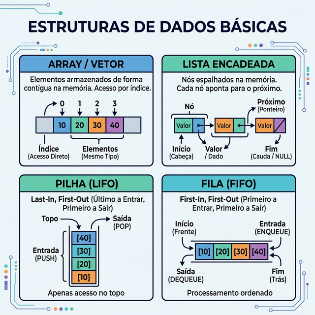

# Módulo 01: Introdução a Estruturas de Dados e Análise de Complexidade

## Sumário
- [1. Introdução](#1-introdução-ao-módulo)
- [2. Conceitos Básicos](#2-conceitos-básicos)
- [3. Análise de Complexidade](#3-análise-de-complexidade)
- [4. Exercícios de Fixação](#4-exercícios-de-fixação)
- [5. Conclusão](#5-conclusão)

---

## 1. Introdução ao Módulo

Bem-vindo ao primeiro módulo do curso de Algoritmos e Estrutura de Dados. Neste módulo, estabeleceremos as bases fundamentais para todo o curso. Entenderemos o que são estruturas de dados, por que a eficiência dos algoritmos é crucial e como medir essa eficiência matematicamente usando a notação Big-O.

---

## 2. Conceitos Básicos

### O que são Estruturas de Dados?

Uma estrutura de dados é uma maneira particular de armazenar e organizar dados em um computador para que possam ser usados de forma eficiente. Diferentes tipos de estruturas de dados são adequados para diferentes tipos de aplicações, e algumas são altamente especializadas para tarefas específicas.

**Exemplos do dia a dia:**
- Uma lista de tarefas (Lista/Array)
- Uma pilha de pratos (Pilha/Stack)
- Uma fila no banco (Fila/Queue)



### Eficiência de Algoritmos

Um algoritmo é um procedimento passo a passo para resolver um problema. A eficiência de um algoritmo é medida por dois fatores principais:
1.  **Tempo de Execução:** Quanto tempo o algoritmo leva para rodar?
2.  **Espaço de Memória:** Quanta memória o algoritmo precisa para rodar?

Em ciência da computação, geralmente nos preocupamos mais com o **crescimento** desses fatores conforme o tamanho da entrada ($n$) aumenta, do que com valores absolutos.

---

## 3. Análise de Complexidade

### Notação Big-O

A Notação Big-O (Grande-O) é a linguagem que usamos para descrever a complexidade de um algoritmo. Ela define o limite superior do tempo de execução (pior caso).

#### Ordens de Complexidade Comuns

1.  **O(1) - Constante:** O tempo de execução não muda, independentemente do tamanho da entrada.
    ```python
    def acessar_primeiro_elemento(lista):
        if lista:
            return lista[0] # Sempre leva o mesmo tempo
        return None
    ```

2.  **O(n) - Linear:** O tempo de execução cresce linearmente com o tamanho da entrada.
    ```python
    def imprimir_elementos(lista):
        for item in lista: # Executa n vezes
            print(item)
    ```

3.  **O(log n) - Logarítmica:** O tempo cresce muito lentamente. Comum em buscas em dados ordenados (ex: Busca Binária).

4.  **O(n²) - Quadrática:** Comum em algoritmos com loops aninhados (ex: Bubble Sort).
    ```python
    def pares_elementos(lista):
        for i in lista:
            for j in lista: # Loop dentro de loop
                print(i, j)
    ```


---

## 4. Exercícios de Fixação

**Exercício 1:** Qual a complexidade de tempo do seguinte código Python?
```python
def exemplo(n):
    return n * n
```
a) O(n)

b) O(1)

c) O(n²)

d) O(log n)

<details>
<summary>Ver Resposta</summary>

**Resposta:** b) O(1)

**Explicação:** Embora a função realize uma multiplicação (n * n), ela executa uma única operação aritmética, independentemente do tamanho do número `n`. Ela não itera sobre uma estrutura de dados de tamanho `n`.
</details>

**Exercício 1.1:** Se tivermos um loop simples percorrendo uma lista de tamanho `n` e, dentro dele, outro loop percorrendo a mesma lista, qual a complexidade total?
a) O(n)

b) O(2n)

c) O(n²)

d) O(n log n)

<details>
<summary>Ver Resposta</summary>

**Resposta:** c) O(n²)

**Explicação:** Para cada elemento do primeiro loop (que roda `n` vezes), o segundo loop também roda `n` vezes. Total de operações: $n \times n = n^2$.
</details>

---

## 5. Conclusão

Neste módulo, aprendemos que escolher a estrutura de dados correta e entender a complexidade do algoritmo é vital para criar software escalável e eficiente. Nos próximos módulos, exploraremos estruturas específicas.

[Próximo módulo →](../teoria/modulo_02_estruturas_lineares.md)

[Voltar aos Links Rápidos](../README.md#links-rapidos)
