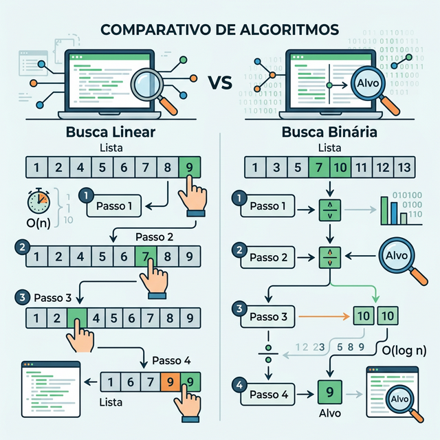
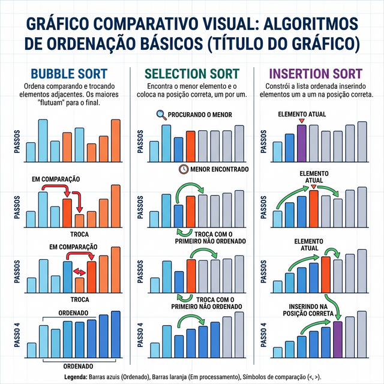
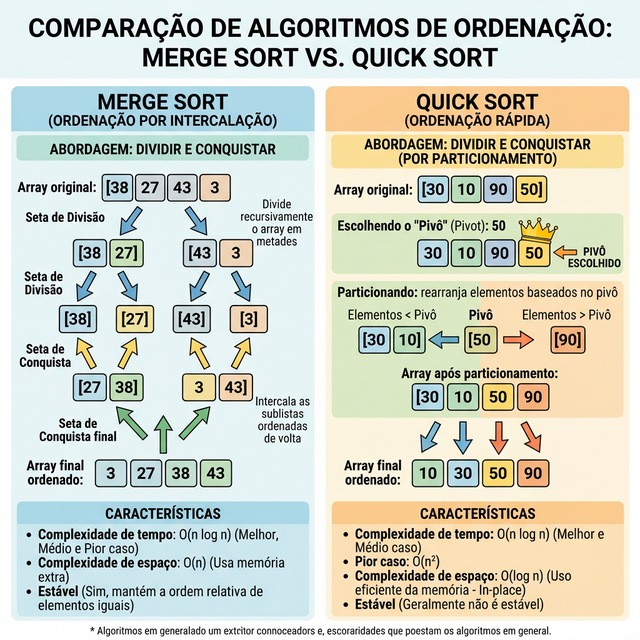

# Módulo 02: Algoritmos de Busca e Ordenação

## Sumário
- [1. Introdução ao Módulo](#1-introducao-ao-modulo)
- [2. Busca](#2-busca)
  - [2.1 Busca Linear (Linear Search)](#21-busca-linear-linear-search)
  - [2.2 Busca Binária (Binary Search)](#22-busca-binaria-binary-search)
- [3. Algoritmos de Ordenação O(n²)](#3-algoritmos-de-ordenacao-on)
  - [3.1 Bubble Sort](#31-bubble-sort)
  - [3.2 Selection Sort](#32-selection-sort)
  - [3.3 Insertion Sort](#33-insertion-sort)
- [4. Algoritmos de Ordenação O(n log n) (Introdução)](#4-algoritmos-de-ordenacao-on-log-n-introducao)
  - [4.1 Merge Sort](#41-merge-sort)
  - [4.2 Quick Sort](#42-quick-sort)

---

## 1. Introdução ao Módulo

Neste módulo, aprenderemos como encontrar elementos e como organizar dados, o que é fundamental para a eficiência de inúmeros sistemas de software. Veremos desde abordagens ingênuas (força bruta) até estratégias mais sofisticadas como Dividir e Conquistar, essenciais para lidar com grandes volumes de informação.

## 2. Busca

### 2.1 Busca Linear (Linear Search)

O método mais simples de busca. Consiste em percorrer cada elemento da estrutura de dados, um por um, a partir do início, até encontrar o elemento alvo ou chegar ao fim da estrutura.

* **Complexidade de Tempo:** O(n) no pior caso (quando o item não está na lista ou é o último).
* **Complexidade de Espaço:** O(1), pois não requer memória adicional significativa.
* **Aplicação:** Útil para dados **não ordenados** ou estruturas muito pequenas onde a sobrecarga de algoritmos mais complexos não compensa.



**Exemplo em Python:**
```python
def busca_linear(lista, alvo):
    for i in range(len(lista)):
        if lista[i] == alvo:
            return i  # Retorna o índice do elemento
    return -1  # Retorna -1 se não encontrar
```

### 2.2 Busca Binária (Binary Search)

Um algoritmo poderoso que exige que a estrutura de dados (como um array) esteja **previamente ordenada**. Ele divide o intervalo de busca pela metade a cada passo, comparando o elemento do meio com o alvo.

* **Complexidade de Tempo:** O(log n) no pior caso.
* **Complexidade de Espaço:** O(1) na versão iterativa, O(log n) na recursiva devido à pilha de chamadas.
* **Aplicação:** Buscas rápidas em bancos de dados e grandes arrays ordenados.

**Exemplo em Python (Iterativo):**
```python
def busca_binaria(lista, alvo):
    inicio = 0
    fim = len(lista) - 1

    while inicio <= fim:
        meio = (inicio + fim) // 2
        
        if lista[meio] == alvo:
            return meio
        elif lista[meio] < alvo:
            inicio = meio + 1
        else:
            fim = meio - 1
            
    return -1
```

**Exercício 2.1:** Qual a principal condição para que a Busca Binária possa ser utilizada em um array?

a) O array deve conter apenas números inteiros positivos.

b) O array deve estar previamente ordenado.

c) O tamanho do array deve ser uma potência de 2.

d) O array deve estar armazenado em estruturas encadeadas.

<details>
<summary>Ver Resposta</summary>

**Resposta:** b) O array deve estar previamente ordenado.

**Explicação:** A Busca Binária depende da propriedade de ordenação para descartar metade do espaço de busca a cada iteração. Se o array não estiver ordenado, não é possível garantir em qual metade o elemento alvo poderia estar, tornando o algoritmo inválido.
</details>

## 3. Algoritmos de Ordenação O(n²)

Estes algoritmos são intuitivos e fáceis de implementar, mas ineficientes para grandes conjuntos de dados (n > 10.000). São ótimos para fins didáticos e para pequenas entradas.

### 3.1 Bubble Sort

Flutua o maior elemento para o final da lista repetidamente trocando elementos adjacentes que estão fora de ordem. Após cada passagem completa, o maior elemento restante encontra seu lugar definitivo.

* **Melhor Caso:** O(n) se a lista já estiver ordenada (com otimização de flag).
* **Pior Caso:** O(n²).

### 3.2 Selection Sort

Divide a lista em duas partes: a parte ordenada à esquerda e a parte não ordenada à direita. Repetidamente **seleciona o menor elemento** da parte não ordenada e o troca com o primeiro elemento não ordenado, expandindo a parte ordenada.

* **Casos:** Sempre toma O(n²), independente de como a lista inicial esteja, pois tem que varrer o resto do array para ter certeza que encontrou o mínimo.

### 3.3 Insertion Sort

Constrói a lista ordenada um elemento de cada vez. Pega o próximo elemento da parte não ordenada e o **insere na posição correta** entre os elementos já ordenados (como organizar cartas de baralho na mão).

* **Melhor Caso:** O(n) (se já estiver ordenado, ele apenas compara uma vez por elemento).
* **Pior Caso:** O(n²).
* **Aplicação:** Muito eficiente para listas pequenas ou listas **quase ordenadas**.



**Exercício 2.2:** Entre os algoritmos O(n²) apresentados, qual possui a característica de sempre executar em tempo O(n²), mesmo se o array já estiver perfeitamente ordenado?

a) Bubble Sort (não otimizado).

b) Selection Sort.

c) Insertion Sort.

d) Merge Sort.

<details>
<summary>Ver Resposta</summary>

**Resposta:** b) Selection Sort.

**Explicação:** O Selection Sort sempre precisará percorrer todo o restante do array para encontrar o menor elemento atual, mesmo que a lista já esteja ordenada. O Insertion e o Bubble (otimizado) conseguem perceber que os elementos já estão no lugar e interromper laços internos, rodando em O(n) no melhor caso.
</details>

## 4. Algoritmos de Ordenação O(n log n) (Introdução)

Para lidar com grandes volumes de dados, abordagens O(n²) quebram rápido. Para resolver isso, usamos o Paradigma de **Dividir e Conquistar**, que divide um problema grande em subproblemas menores recursivamente.

### 4.1 Merge Sort

Divide o array na metade até sobrar elementos individuais. Em seguida, intercala (merge) esses sub-arrays reconstruindo um array final de forma ordenada.

* **Complexidade de Tempo:** Estritamente O(n log n) para todos os casos.
* **Ponto Negativo:** Usa memória extra O(n) para criar os arrays temporários durante o merge, não sendo "in-place".

### 4.2 Quick Sort

Escolhe um elemento chamado "pivô" e particiona os demais elementos de modo que menores fiquem à esquerda e maiores à direita. Repete o processo para as duas metades recursivamente.

* **Complexidade de Tempo:** O(n log n) no caso médio. O(n²) no pior caso (se escolher sempre o pior pivô em listas já ordenadas, embora existam contramedidas como escolher pivôs aleatórios).
* **Ponto Positivo:** É "in-place" em relação aos dados e tem fatores constantes muito pequenos, sendo geralmente **o algoritmo de ordenação geral mais rápido na prática**.



[Próximo módulo →](../teoria/modulo_03_estruturas_lineares.md)

[← Módulo anterior](../teoria/modulo_01_introducao_a_estruturas_de_dados_e_analise_de_complexidade.md)

[Voltar aos Links Rápidos](../README.md#links-rapidos)
