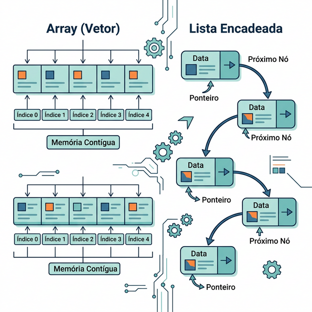

# Módulo 02: Estruturas Lineares

## Sumário
- [1. Introdução](#1-introdução-ao-módulo)
- [2. Listas e Arrays](#2-listas-e-arrays)
- [3. Pilhas (Stacks)](#3-pilhas-stacks)
- [4. Filas (Queues)](#4-filas-queues)
- [5. Exercícios de Fixação](#5-exercícios-de-fixação)
- [6. Conclusão](#6-conclusão)

---

## 1. Introdução ao Módulo

Neste módulo, exploraremos as estruturas de dados lineares, onde os elementos são organizados sequencialmente. Elas são a base para estruturas mais complexas e são fundamentais para a manipulação de dados na memória.

---

## 2. Listas e Arrays

### Conceitos
- **Array:** Uma coleção de elementos de tamanho fixo (em linguagens de baixo nível) ou dinâmico, armazenados contiguamente na memória. Permite acesso aleatório rápido O(1).
- **Lista Encadeada:** Uma sequência de nós onde cada nó aponta para o próximo. Permite inserções e remoções eficientes O(1) se tivermos a referência do nó, mas acesso sequencial lento O(n).

Em Python, a estrutura `list` é implementada como um **Array Dinâmico**.

```python
# Exemplo de Lista em Python
frutas = ["Maçã", "Banana", "Laranja"]

# Acesso O(1)
print(frutas[0]) 

# Inserção no final O(1) (amortizado)
frutas.append("Uva")

# Inserção no meio O(n) (precisa deslocar elementos)
frutas.insert(1, "Morango")
```



---

## 3. Pilhas (Stacks)

### Pilhas (Stacks)
Estrutura LIFO (Last-In, First-Out). Imagine uma pilha de pratos: o último que você coloca é o primeiro que você tira.

### Operações Básicas
- **Push:** Adicionar ao topo.
- **Pop:** Remover do topo.
- **Peek:** Olhar o topo sem remover.

### Implementação em Python
Podemos usar a própria `list`.

```python
pilha = []
pilha.append(10) # Push
pilha.append(20)
topo = pilha.pop() # Pop (retorna 20)
```

[IMAGEM_CONCEITO_PILHA]

---

## 4. Filas (Queues)

### Conceito FIFO (First In, First Out)
O primeiro a entrar é o primeiro a sair. Imagine uma fila de banco.

### Operações Básicas
- **Enqueue:** Adicionar ao final.
- **Dequeue:** Remover do início.

### Implementação em Python
Usar `list` para filas é ineficiente para `dequeue` (O(n)). O ideal é usar `collections.deque`.

```python
from collections import deque

fila = deque()
fila.append("Cliente A") # Enqueue
fila.append("Cliente B")
proximo = fila.popleft() # Dequeue ("Cliente A") - O(1)
```

[IMAGEM_CONCEITO_FILA]

---

## 5. Exercícios de Fixação

**Exercício 1:** Qual estrutura de dados é mais adequada para implementar a funcionalidade "Desfazer" (Undo) de um editor de texto?
a) Fila (Queue)

b) Array

c) Pilha (Stack)

d) Árvore Binária

<details>
<summary>Ver Resposta</summary>

**Resposta:** c) Pilha (Stack)

**Explicação:** A ação de desfazer reverte a operação mais recente. Isso segue a lógica LIFO (Last In, First Out), perfeitamente modelada por uma Pilha.
</details>

**Exercício 2:** Qual a complexidade de tempo para remover o **primeiro** elemento de uma lista padrão do Python (`list.pop(0)`)?
a) O(1)

b) O(log n)

c) O(n)

d) O(n²)

<details>
<summary>Ver Resposta</summary>

**Resposta:** c) O(n)

**Explicação:** Como as listas em Python são arrays dinâmicos, remover o primeiro elemento exige que todos os elementos subsequentes sejam deslocados uma posição para a esquerda na memória para preencher o vazio.
</details>

---

## 6. Conclusão

Arrays, Pilhas e Filas são ferramentas essenciais. Saber quando usar `deque` em vez de `list` ou quando uma Pilha resolve seu problema de "histórico" é o que diferencia programadores iniciantes de avançados.

[Próximo módulo →](../teoria/modulo_03_hashmaps_e_dicionarios.md)

[Voltar aos Links Rápidos](../README.md#links-rapidos)
