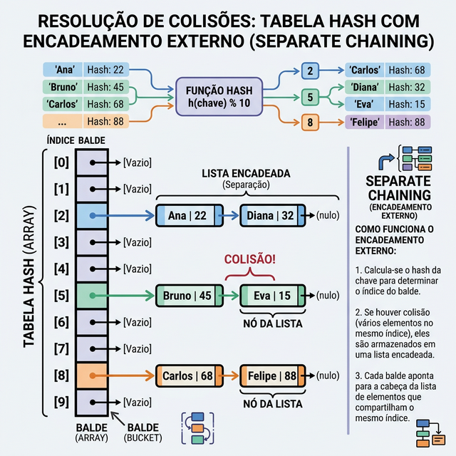

# Módulo 03: HashMaps e Sets

## Sumário
- [1. Introdução](#1-introdução-ao-módulo)
- [2. Conceito de Hashing](#2-conceito-de-hashing)
- [3. Dicionários (HashMaps)](#3-dicionários-hashmaps)
- [4. Sets (Conjuntos)](#4-sets-conjuntos)
- [5. Tratamento de Colisões](#5-tratamento-de-colisões)
- [6. Aplicações Práticas](#6-aplicações-práticas)
- [7. Exercícios de Fixação](#7-exercícios-de-fixação)
- [8. Conclusão](#8-conclusão)

---

## 1. Introdução ao Módulo

HashMaps (ou Tabelas Hash) são indiscutivelmente uma das estruturas de dados mais importantes que você vai aprender. Elas permitem mapear chaves a valores com uma eficiência incrível, geralmente O(1) para inserção, busca e remoção. 

Neste módulo, vamos explorar duas estruturas fundamentais baseadas em hashing: **Dicionários** (que armazenam pares chave-valor) e **Sets** (que armazenam apenas elementos únicos). Ambas usam a mesma técnica por baixo dos panos, mas servem a propósitos diferentes.

---

## 2. Conceito de Hashing

### O que é uma Tabela Hash?

Imagine que você tem uma agenda telefônica. Em vez de procurar o nome de alguém página por página (o que seria lento), você quer ir direto na página certa. É exatamente isso que uma tabela hash faz!

É uma estrutura que armazena pares de chave-valor. Ela usa uma **Função Hash** para calcular um índice em um array (chamado de "bucket" ou balde) onde o valor desejado deve ser armazenado.

### Função Hash

Uma função hash é basicamente uma função matemática que transforma qualquer entrada (como uma string ou número) em um número inteiro. Esse número é usado como índice para saber onde guardar ou buscar o valor.

**Exemplo simples:**
```python
hash("Alice") -> 14532
hash("Bob") -> 8921
```

Pense nisso como um "endereço" calculado automaticamente. Quando você quer buscar "Alice", a função hash calcula o mesmo número (14532) e você vai direto lá, sem precisar procurar em todos os lugares.

[IMAGEM_CONCEITO_HASHING]

### Em Python

Python possui duas estruturas robustas baseadas em hash que você já deve conhecer:
- **`dict` (Dicionário):** Armazena pares chave-valor. Como um dicionário real: você procura pela palavra (chave) e encontra o significado (valor).
- **`set` (Conjunto):** Armazena apenas chaves únicas, sem valores associados. É como uma lista, mas que não permite duplicatas.

```python
# Dicionário - chave -> valor
telefones = {"Alice": 1234, "Bob": 5678}
print(telefones["Alice"])  # 1234 - acesso O(1)

# Set - apenas elementos únicos
unicos = {1, 2, 3, 3, 2}
print(unicos)  # {1, 2, 3} - remove duplicatas automaticamente
```

### Curiosidades: nomes diferentes, mesma ideia

Você vai ver esses nomes por aí (e é normal ficar confuso no começo):

- **Set** também aparece como **conjunto** (em português) ou **HashSet** (Java/C#). Em C++, o “set com hash” costuma ser o `unordered_set`.
- **Map** (ou **mapa**) é o mesmo conceito de **dicionário**: uma estrutura de **chave → valor**. Em Java, por exemplo, você vai ver `HashMap`. Em C++, o equivalente com hash costuma ser `unordered_map`.
- Em algumas linguagens, dicionário/mapa também é chamado de **associative array** (array associativo).
- **Detalhe do Python:** desde o Python 3.7+, o `dict` mantém a **ordem de inserção**. Isso não muda a ideia principal (chave → valor), mas é uma curiosidade útil.

---

## 3. Dicionários (HashMaps)

### O que são Dicionários?

Dicionários são como agendas telefônicas digitais. Você tem um nome (chave) e quer encontrar o telefone (valor). A mágica é que essa busca é super rápida - O(1) em média!

### Operações Básicas

Vamos ver as operações principais que você pode fazer com dicionários:

```python
# Criar um dicionário
pessoas = {}

# Adicionar ou atualizar (O(1))
pessoas["Alice"] = 25
pessoas["Bob"] = 30

# Buscar um valor (O(1))
idade_alice = pessoas["Alice"]  # 25

# Verificar se existe uma chave (O(1))
if "Alice" in pessoas:
    print("Alice está no dicionário!")

# Remover (O(1))
del pessoas["Bob"]

# Percorrer chaves e valores
for nome, idade in pessoas.items():
    print(f"{nome} tem {idade} anos")
```

### Quando usar Dicionários?

Use dicionários quando você precisa:
- **Mapear uma coisa para outra:** nome → telefone, ID → objeto, palavra → tradução
- **Contar frequências:** quantas vezes cada palavra aparece em um texto
- **Armazenar configurações:** preferências do usuário, configurações de sistema
- **Criar índices rápidos:** para buscar dados rapidamente sem percorrer listas inteiras

**Exemplo prático - Contagem de palavras:**
```python
texto = "gato cachorro gato peixe gato"
palavras = texto.split()

contagem = {}
for palavra in palavras:
    if palavra in contagem:
        contagem[palavra] += 1
    else:
        contagem[palavra] = 1

# Ou de forma mais elegante:
contagem = {}
for palavra in palavras:
    contagem[palavra] = contagem.get(palavra, 0) + 1

print(contagem)  # {'gato': 3, 'cachorro': 1, 'peixe': 1}
```

---

## 4. Sets (Conjuntos)

### O que são Sets?

Sets são como listas, mas com uma diferença crucial: **não permitem elementos duplicados**. Eles são perfeitos quando você só precisa saber "essa coisa existe ou não?" sem se preocupar com quantas vezes ela aparece.

### Operações Básicas

```python
# Criar um set
frutas = {"maçã", "banana", "laranja"}

# Adicionar elemento (O(1))
frutas.add("uva")

# Tentar adicionar duplicata (não faz nada)
frutas.add("maçã")  # Continua sendo {"maçã", "banana", "laranja", "uva"}

# Verificar se existe (O(1))
if "maçã" in frutas:
    print("Temos maçã!")

# Remover (O(1))
frutas.remove("banana")

# Operações matemáticas com sets
frutas1 = {"maçã", "banana", "laranja"}
frutas2 = {"laranja", "uva", "manga"}

# União - todas as frutas de ambos
todas = frutas1 | frutas2  # {"maçã", "banana", "laranja", "uva", "manga"}

# Interseção - frutas em ambos
comuns = frutas1 & frutas2  # {"laranja"}

# Diferença - frutas só no primeiro
so_frutas1 = frutas1 - frutas2  # {"maçã", "banana"}
```

### Quando usar Sets?

Sets são perfeitos quando você precisa:
- **Remover duplicatas:** de uma lista rapidamente
- **Verificar existência rapidamente:** "esse item já foi processado?"
- **Operações de conjunto:** união, interseção, diferença
- **Rastrear elementos únicos:** IDs já visitados, emails únicos, etc.

**Exemplo prático - Remover duplicatas:**
```python
# Forma lenta com lista (O(n²))
lista_com_duplicatas = [1, 2, 2, 3, 3, 3, 4]
lista_sem_duplicatas = []
for item in lista_com_duplicatas:
    if item not in lista_sem_duplicatas:  # O(n) para cada verificação!
        lista_sem_duplicatas.append(item)

# Forma rápida com set (O(n))
lista_sem_duplicatas = list(set(lista_com_duplicatas))
# [1, 2, 3, 4]
```

**Exemplo prático - Verificar elementos visitados:**
```python
visitados = set()

def processar_usuario(id_usuario):
    if id_usuario in visitados:
        print(f"Usuário {id_usuario} já foi processado!")
        return
    
    visitados.add(id_usuario)
    # Processar o usuário...
    print(f"Processando usuário {id_usuario}")
```

### Sets vs Dicionários: Qual usar?

- **Use Dicionário** quando você precisa associar uma chave a um valor (nome → telefone, ID → objeto)
- **Use Set** quando você só precisa saber se algo existe ou não, sem precisar de um valor associado

Pense assim: se você precisa guardar "o quê" além de "se existe", use dicionário. Se só precisa saber "se existe", use set.

---

## 5. Tratamento de Colisões

O que acontece se duas chaves diferentes gerarem o mesmo hash? Por exemplo, se "Alice" e "Bob" caírem no mesmo índice? Isso é uma **colisão**.

### Encadeamento (Chaining)

A solução mais comum é fazer cada bucket do array conter uma lista encadeada. Se houver colisão, simplesmente adicionamos o item na lista daquele bucket.

Pense como uma gaveta com várias coisas dentro. Se duas pessoas têm o mesmo "endereço" (hash), elas vão para a mesma gaveta, mas ficam em lugares diferentes dentro dela.



### Endereçamento Aberto (Open Addressing)

Outra abordagem é, se o bucket estiver ocupado, procurar o próximo bucket vizinho vazio (Linear Probing) ou usar outra regra para encontrar um lugar livre.

É como procurar vaga de estacionamento: se o lugar ideal está ocupado, você vai para o próximo disponível.

### Por que isso importa?

Em Python, você não precisa se preocupar com isso manualmente - o Python cuida de tudo para você! Mas entender como funciona ajuda você a escolher quando usar dicionários e sets, e por que eles são tão rápidos.

---

## 6. Aplicações Práticas

Vamos ver alguns casos reais onde HashMaps e Sets são essenciais:

1. **Caches:** Armazenar resultados de computações caras para acesso rápido. Por exemplo, cachear resultados de uma API para não fazer a mesma requisição várias vezes.

2. **Bancos de Dados:** Indexação de registros. Quando você faz uma busca por ID, o banco usa uma estrutura similar a um hashmap para encontrar o registro rapidamente.

3. **Contagem de Frequência:** Contar quantas vezes palavras aparecem em um texto, quantas vezes cada número aparece em uma lista, etc.

4. **Remover Duplicatas:** Limpar dados duplicados de forma eficiente.

5. **Rastreamento de Estado:** Manter controle de elementos já processados, páginas visitadas, etc.

6. **Sistemas de Autenticação:** Armazenar tokens de sessão, verificar se um usuário está logado, etc.

---

## 7. Exercícios de Fixação

**Exercício 1:** Qual é a complexidade de tempo média para buscar um elemento em uma Tabela Hash bem dimensionada?
a) O(log n)

b) O(n)

c) O(1)

d) O(n²)

<details>
<summary>Ver Resposta</summary>

**Resposta:** c) O(1)

**Explicação:** Graças à função hash, podemos ir diretamente ao endereço de memória onde o valor está armazenado, sem precisar percorrer os outros elementos. É como ter um GPS que te leva direto ao destino!
</details>

**Exercício 2:** Em Python, qual tipo de dado NÃO pode ser usado como chave em um dicionário?
a) String

b) Inteiro

c) Lista (List)

d) Tupla (Tuple)

<details>
<summary>Ver Resposta</summary>

**Resposta:** c) Lista (List)

**Explicação:** Chaves de dicionários devem ser **imutáveis (hashable)**. Listas são mutáveis (podem ser alteradas), portanto seu hash mudaria se o conteúdo mudasse, quebrando a estrutura da tabela. Tuplas são imutáveis e podem ser chaves (desde que contenham apenas elementos imutáveis).
</details>

**Exercício 3:** Qual estrutura você usaria para verificar rapidamente se um email já está cadastrado no sistema?
a) Lista

b) Set

c) Dicionário

d) Tupla

<details>
<summary>Ver Resposta</summary>

**Resposta:** b) Set

**Explicação:** Como você só precisa saber se o email existe ou não (sem precisar de um valor associado), um Set é perfeito. A verificação é O(1) e você não desperdiça memória guardando valores desnecessários.
</details>

---

## 8. Conclusão

HashMaps e Sets são ferramentas fundamentais na programação. Eles são a base para muitas operações eficientes que você vai fazer no dia a dia.

**Lembre-se:**
- Use **Dicionários** quando precisar mapear chaves para valores
- Use **Sets** quando só precisar verificar existência ou remover duplicatas
- Ambos oferecem operações O(1) em média, tornando-os extremamente eficientes
- Em Python, `dict` e `set` já são implementados de forma otimizada - aproveite!

Se você precisa verificar existência ou buscar itens por uma chave única, use um Hash Map (`dict`) ou um Set (`set`). Eles vão tornar seu código muito mais rápido e eficiente!

[Próximo módulo →](../teoria/modulo_04_arvores_e_heaps.md)

[Voltar aos Links Rápidos](../README.md#links-rapidos)
