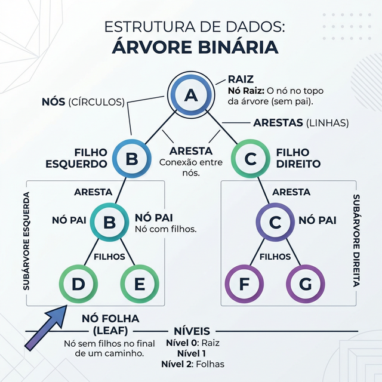
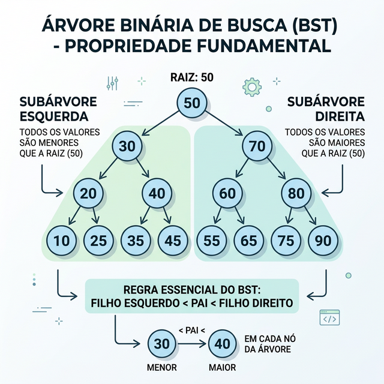

# Módulo 04: Árvores e Heaps

## Sumário
- [1. Introdução](#1-introdução-ao-módulo)
- [2. Árvores Binárias](#2-árvores-binárias)
- [3. Árvores Binárias de Busca (BST)](#3-árvores-binárias-de-busca-bst)
- [4. Heaps Binários](#4-heaps-binários)
- [5. Union-Find](#5-union-find)
- [6. Exercícios de Fixação](#6-exercícios-de-fixação)
- [7. Conclusão](#7-conclusão)

---

## 1. Introdução ao Módulo

Diferente das estruturas lineares, as **Árvores** organizam dados de forma hierárquica. Elas são fundamentais para representar estruturas como sistemas de arquivos, HTML (DOM) e para algoritmos de busca e ordenação eficientes.

---

## 2. Árvores Binárias

### Estrutura
- **Raiz (Root):** O nó superior.
- **Nó Filho (Child):** Nó conectado abaixo de outro.
- **Folha (Leaf):** Nó sem filhos.

Em uma Árvore Binária, cada nó tem no máximo **dois** filhos: Esquerda e Direita.

### Travessias (Traversals)
Como percorrer todos os nós?
1.  **Pré-ordem:** Raiz -> Esquerda -> Direita
2.  **In-ordem:** Esquerda -> Raiz -> Direita
3.  **Pós-ordem:** Esquerda -> Direita -> Raiz

---

## 3. Árvores Binárias de Busca (BST)

Uma BST é uma árvore binária com uma propriedade especial:
- Todos os valores na subárvore à **Esquerda** são **menores** que a raiz.
- Todos os valores na subárvore à **Direita** são **maiores** que a raiz.

Isso permite busca rápida (O(log n) em média).

---

## 4. Heaps Binários

Heaps são árvores binárias especiais usadas para implementar **Filas de Prioridade**.

- **Max-Heap:** O pai é sempre maior ou igual aos filhos. O maior elemento está na raiz.
- **Min-Heap:** O pai é sempre menor ou igual aos filhos. O menor elemento está na raiz.

Geralmente implementados usando **Arrays** para economizar memória (sem ponteiros).

[IMAGEM_HEAP_ESTRUTURA]

---

## 5. Union-Find

Uma estrutura de dados para gerenciar conjuntos disjuntos (grupos separados). Muito usada em algoritmos de grafos (como Kruskal).
- **Find:** Descobre a qual grupo um elemento pertence.
- **Union:** Une dois grupos em um só.

---

## 6. Exercícios de Fixação

**Exercício 1:** Em uma BST balanceada contendo `n` elementos, qual a complexidade da busca?
a) O(1)

b) O(n)

c) O(log n)

d) O(n²)

Ver Resposta

**Resposta:** c) O(log n)

**Explicação:** Como a cada passo eliminamos metade da árvore (esquerda ou direita), a busca é logarítmica, similar à busca binária em um array ordenado.

**Exercício 2:** Em um Max-Heap, onde está garantidamente o **segundo** maior elemento?
a) No filho esquerdo da raiz

b) No filho direito da raiz

c) Em um dos filhos da raiz (esquerdo ou direito)

d) Na última folha

Ver Resposta

**Resposta:** c) Em um dos filhos da raiz (esquerdo ou direito)

**Explicação:** O maior elemento está na Raiz. O segundo maior deve ser obrigatoriamente um filho direto da raiz, pois se estivesse mais abaixo, violaria a propriedade de que pais são maiores que filhos.

---

## 7. Conclusão

Árvores trazem complexidade, mas também poder. BSTs aceleram buscas e Heaps gerenciam prioridades com eficiência incrível.

[Próximo módulo →](../teoria/modulo_05_grafos_e_algoritmos_de_busca.md)

[Voltar aos Links Rápidos](../README.md#links-rapidos)
