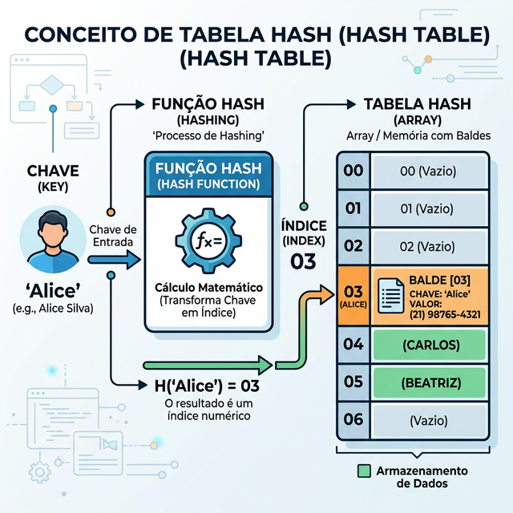
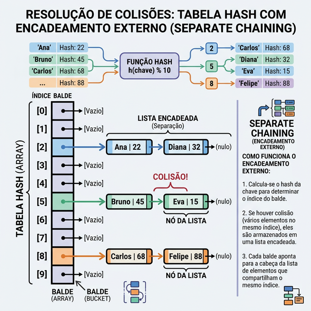

# Módulo 04: HashMaps e Dicionários

## Sumário
- [1. Introdução](#1-introdução-ao-módulo)
- [2. Conceito de Hashing](#2-conceito-de-hashing)
- [3. Tratamento de Colisões](#3-tratamento-de-colisões)
- [4. Aplicações Práticas](#4-aplicações-práticas)
- [5. Exercícios de Fixação](#5-exercícios-de-fixação)
- [6. Conclusão](#6-conclusão)

---

## 1. Introdução ao Módulo

HashMaps (ou Tabelas Hash) são indiscutivelmente uma das estruturas de dados mais importantes. Elas permitem mapear chaves a valores com uma eficiência incrível, geralmente O(1) para inserção, busca e remoção.

---

## 2. Conceito de Hashing

### O que é uma Tabela Hash?
É uma estrutura que armazena pares de chave-valor. Ela usa uma **Função Hash** para calcular um índice em um array (chamado de "bucket" ou balde) onde o valor desejado deve ser armazenado.

### Função Hash
Uma função matemática que transforma uma entrada (chave) em um número inteiro (hash).
Ex: `hash("nome") -> 14532`



### Operações Básicas
- **Inserção (Put/Set):** Adicionar um novo par de chave e valor. A chave é submetida a uma função de hash para determinar o índice.
- **Busca (Get):** Recuperar o valor associado a uma determinada chave em tempo O(1) na média.
- **Remoção (Delete/Remove):** Localizar e remover o par chave-valor com base na chave.

### Em Python
Python possui duas estruturas robustas baseadas em hash:
- **`dict` (Dicionário):** Armazena pares chave-valor.
- **`set` (Conjunto):** Armazena apenas chaves únicas (sem valores associados).

```python
# Dicionário
telefones = {"Alice": 1234, "Bob": 5678}

# Inserção O(1)
telefones["Carlos"] = 9012

# Busca O(1)
print(telefones["Alice"]) 

# Remoção O(1)
del telefones["Bob"]

# Set
unicos = {1, 2, 3, 3, 2}

# Inserção O(1)
unicos.add(4)

# Remoção O(1)
unicos.remove(2)

print(unicos) # {1, 3, 4} - remove duplicatas automaticamente
```

---

## 3. Tratamento de Colisões

O que acontece se "Alice" e "Bob" caírem no mesmo índice? Isso é uma **colisão**.

### Encadeamento (Chaining)
Cada bucket do array contém uma lista encadeada. Se houver colisão, adicionamos o item na lista.



### Endereçamento Aberto (Open Addressing)
Se o balde estiver ocupado, procuramos o próximo balde vizinho vazio (Linear Probing) ou usamos outra regra para encontrar um lugar livre.

---

## 4. Aplicações Práticas

1.  **Caches:** Armazenar resultados de computações caras para acesso rápido.
2.  **Bancos de Dados:** Indexação de registros.
3.  **Contagem de Frequência:** Contar quantas vezes palavras aparecem em um texto.

---

## 5. Exercícios de Fixação

**Exercício 1:** Qual é a complexidade de tempo média para buscar um elemento em uma Tabela Hash bem dimensionada?
a) O(log n)

b) O(n)

c) O(1)

d) O(n²)

<details>
<summary>Ver Resposta</summary>

**Resposta:** c) O(1)

**Explicação:** Graças à função hash, podemos ir diretamente ao endereço de memória onde o valor está armazenado, sem precisar percorrer os outros elementos.
</details>

**Exercício 2:** Em Python, qual tipo de dado NÃO pode ser usado como chave em um dicionário?
a) String

b) Inteiro

c) Lista (List)

d) Tupla (Tuple)

<details>
<summary>Ver Resposta</summary>

**Resposta:** c) Lista (List)

**Explicação:** Chaves de dicionários devem ser **imutáveis (hashable)**. Listas são mutáveis (podem ser alteradas), portanto seu hash mudaria se o conteúdo mudasse, quebrando a estrutura da tabela. Tuplas são imutáveis e podem ser chaves (desde que contenham apenas elementos imutáveis).
</details>

---

## 6. Conclusão

HashMaps são a ferramenta padrão para "lookups" rápidos. Se você precisa verificar existência ou buscar itens por uma chave única, use um Hash Map (`dict` ou `set`).

[Próximo módulo →](../teoria/modulo_05_arvores_e_heaps.md)

[← Módulo anterior](../teoria/modulo_03_estruturas_lineares.md)

[Voltar aos Links Rápidos](../README.md#links-rapidos)
