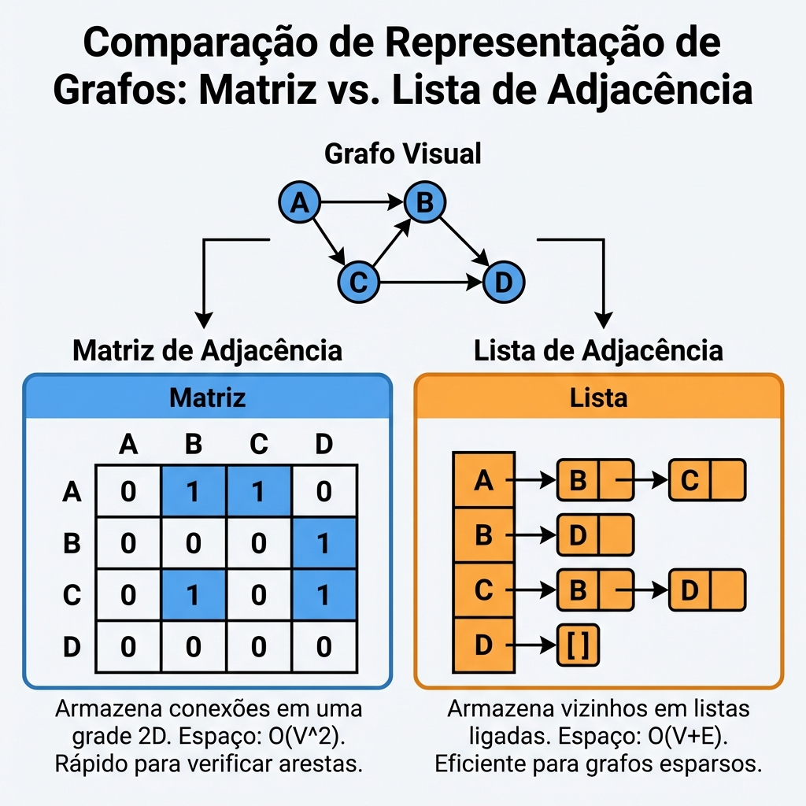
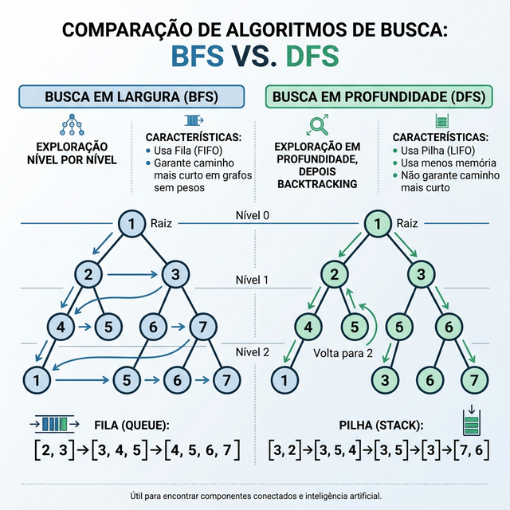

# Módulo 05: Grafos e Algoritmos de Busca

## Sumário
- [1. Introdução](#1-introdução-ao-módulo)
- [2. Conceitos de Grafos](#2-conceitos-de-grafos)
- [3. Representação de Grafos](#3-representação-de-grafos)
- [4. Algoritmos de Busca](#4-algoritmos-de-busca)
- [5. Exercícios de Fixação](#5-exercícios-de-fixação)
- [6. Conclusão](#6-conclusão)

---

## 1. Introdução ao Módulo

Grafos são a estrutura mais versátil da computação. Eles modelam redes sociais, mapas, conexões de internet, dependências de pacotes e muito mais. Se você tem "coisas" conectadas a outras "coisas", você tem um grafo.

---

## 2. Conceitos de Grafos

### Terminologia
- **Vértice (Vertex/Node):** O ponto ou objeto (ex: um usuário).
- **Aresta (Edge):** A conexão entre dois vértices (ex: uma amizade).
- **Direcionado vs Não Direcionado:**
  - **Direcionado (Digraph):** Arestas têm sentido (A -> B). Ex: Seguir no Twitter.
  - **Não Direcionado:** A conexão é mútua (A - B). Ex: Amizade no Facebook.

[IMAGEM_GRAFO_CONCEITO]

---

## 3. Representação de Grafos

Como guardar isso na memória?

### Lista de Adjacência
Cada vértice tem uma lista de vértices aos quais está conectado.
Usa menos memória para grafos esparsos (poucas arestas).
```python
grafo = {
    'A': ['B', 'C'],
    'B': ['D'],
    'C': [],
    'D': ['A']
}
```

### Matriz de Adjacência
Uma grade NxN onde 1 indica conexão e 0 indica desconexão.
Rápido para verificar se A está conectado a B (O(1)), mas gasta muita memória (O(V²)).



---

## 4. Algoritmos de Busca

### BFS (Breadth-First Search) - Busca em Largura
Explora vizinhos nível por nível. Como uma onda se espalhando na água.
- **Uso:** Encontrar o caminho mais curto em grafos não ponderados (menor número de arestas).
- **Estrutura:** Usa uma **Fila**.

### DFS (Depth-First Search) - Busca em Profundidade
Explora o mais fundo possível em um ramo antes de voltar (backtrack). Como explorar um labirinto.
- **Uso:** Detectar ciclos, verificar conectividade, resolver labirintos.
- **Estrutura:** Usa uma **Pilha** (ou recursão).



---

## 5. Exercícios de Fixação

**Exercício 1:** Qual algoritmo é garantido para encontrar o caminho com o menor número de arestas entre dois nós em um grafo não ponderado?
a) DFS

b) BFS

c) Busca Binária

d) Ordenação Topológica

<details>
<summary>Ver Resposta</summary>

**Resposta:** b) BFS

**Explicação:** O BFS explora o grafo em "camadas". Ele visita todos os vizinhos a uma distância 1, depois todos a distância 2, e assim por diante. Portanto, assim que encontra o alvo, garante-se que é o caminho mais curto em arestas.
</details>

**Exercício 2:** Em um grafo representando uma Rede Social onde as arestas são amizades, o que representa um vértice com muitas arestas (alto grau)?
a) Uma pessoa antissocial

b) Uma pessoa popular / influenciador

c) Um erro no banco de dados

d) Um ciclo infinito

<details>
<summary>Ver Resposta</summary>

**Resposta:** b) Uma pessoa popular / influenciador

**Explicação:** O "grau" de um vértice é o número de conexões que ele possui. Muitos amigos = alto grau.
</details>

---

## 6. Conclusão

Dominar BFS e DFS é essencial. Quase todos os problemas avançados de grafos (Dijkstra, Prim, etc.) são variações ou especializações dessas duas buscas fundamentais.

[Próximo módulo →](../teoria/modulo_06_grafos_ponderados_e_otimizacao.md)

[Voltar aos Links Rápidos](../README.md#links-rapidos)
