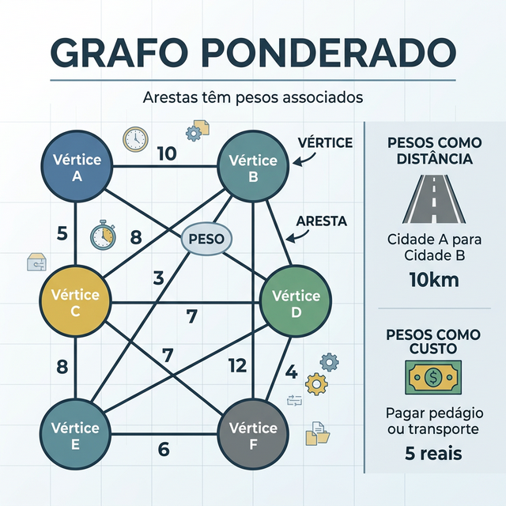
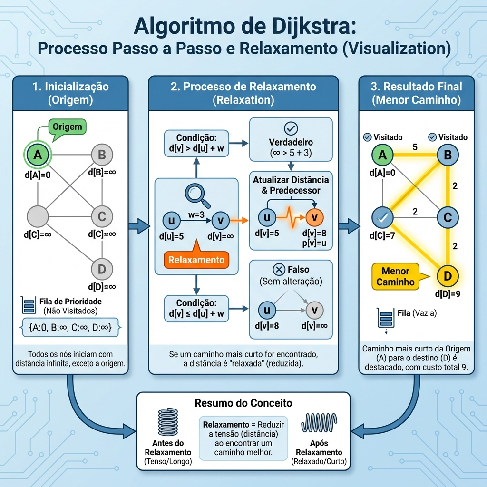

# Módulo 06: Grafos Ponderados e Otimização

## Sumário
- [1. Introdução](#1-introdução-ao-módulo)
- [2. Algoritmo de Dijkstra](#2-algoritmo-de-dijkstra)
- [3. Árvores Geradoras Mínimas (MST)](#3-árvores-geradoras-mínimas-mst)
- [4. Exercícios de Fixação](#4-exercícios-de-fixação)
- [5. Conclusão](#5-conclusão)

---

## 1. Introdução ao Módulo

Nem todas as conexões são iguais. Em um mapa, algumas estradas são mais longas que outras. Em uma rede, alguns cabos são mais rápidos. Grafos Ponderados atribuem um "peso" (custo) a cada aresta.

---

## 2. Algoritmo de Dijkstra

O algoritmo "rei" para encontrar o caminho mais curto em grafos com pesos positivos. Ele usa uma estratégia **Gulosa** com uma **Fila de Prioridade**.

**Como funciona:**
1.  Comece na origem com distância 0.
2.  Todos os outros nós têm distância "Infinito".
3.  Use uma Fila de Prioridade para explorar o nó com a menor distância atual.
4.  Para cada vizinho desse nó, verifique se o caminho até ele é menor do que o que já conhecemos ("Relaxamento").
5.  Repita até visitar todos.

**Complexidade:** O(E log V) usando Heap Binário.

---

## 3. Árvores Geradoras Mínimas (MST)

Imagine que você quer conectar várias casas com cabos de internet com o menor custo possível. Você quer conectar todos sem criar loops.

Uma **MST (Minimum Spanning Tree)** de um grafo é um subconjunto de arestas que:
1.  Conecta todos os vértices.
2.  Não forma ciclos (é uma árvore).
3.  Tem a **soma dos pesos mínima** possível.

**Aplicações:** Planejar cabeamento elétrico, redes de computadores (para economizar fio/custo).

### Algoritmos Principais
- **Kruskal:** Ordena todas as arestas por peso e adiciona uma a uma, desde que não feche ciclo (usa Union-Find).
- **Prim:** Começa de um nó arbitrário e cresce a árvore adicionando a aresta "segura" mais leve.

---

## 4. Exercícios de Fixação

**Exercício 1:** O algoritmo de Dijkstra funciona corretamente com arestas de peso negativo?
a) Sim, sempre.

b) Sim, mas apenas se não houver ciclos.

c) Não, pesos negativos podem quebrar a lógica "gulosa" do Dijkstra.

d) Depende da implementação da fila.

Ver Resposta

**Resposta:** c) Não

**Explicação:** O Dijkstra assume que, ao adicionar uma aresta a um caminho, a distância total nunca diminui. Com pesos negativos, essa premissa falha. Para pesos negativos, usa-se o algoritmo de **Bellman-Ford**.

**Exercício 2:** Qual a principal diferença entre o problema do Caminho Mínimo (Dijkstra) e MST (Prim/Kruskal)?
a) Um usa grafo e o outro usa árvore.

b) Dijkstra busca a rota mais curta entre dois pontos; MST busca conectar TODOS os pontos com custo total mínimo.

c) Não há diferença, ambos resolvem o mesmo problema.

d) MST só funciona em grafos direcionados.

Ver Resposta

**Resposta:** b) Dijkstra busca a rota mais curta entre dois pontos; MST busca conectar TODOS os pontos com custo total mínimo.

**Explicação:** O caminho mais curto entre A e B pode não fazer parte da MST. São objetivos de otimização diferentes.

---

## 5. Conclusão

Grafos ponderados nos permitem modelar o mundo real com muito mais precisão, levando em conta custos, distâncias e tempo.

[Próximo módulo →](../teoria/modulo_07_programacao_dinamica_e_problemas_praticos.md)

[Voltar aos Links Rápidos](../README.md#links-rapidos)
