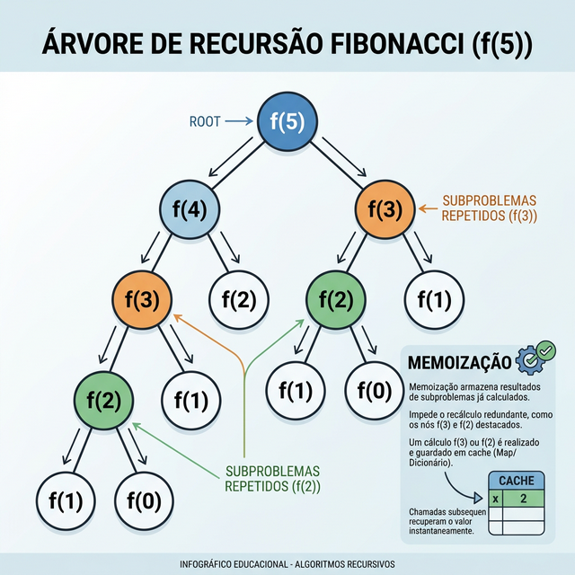
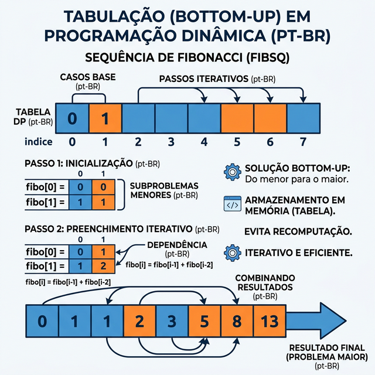

# Módulo 07: Programação Dinâmica e Problemas Práticos

## Sumário
- [1. Introdução](#1-introdução-ao-módulo)
- [2. Conceitos Fundamentais](#2-conceitos-fundamentais)
- [3. Problemas Clássicos](#3-problemas-clássicos)
- [4. Exercícios de Fixação](#4-exercícios-de-fixação)
- [5. Conclusão](#5-conclusão)

---

## 1. Introdução ao Módulo

Programação Dinâmica (DP) é uma técnica para otimizar algoritmos recursivos. A ideia central é simples: **não recalcule o que você já calculou**. Se um problema pode ser dividido em subproblemas que se repetem, use DP.

---

## 2. Conceitos Fundamentais

### 1. Subproblemas Sobrepostos
O problema maior depende de subproblemas menores que são resolvidos várias vezes.
Exemplo: Fibonacci(5) precisa de Fib(4) e Fib(3). Fib(4) precisa de Fib(3) e Fib(2). Note que Fib(3) aparece duas vezes.

### 2. Estrutura Ótima
A solução ótima do problema global pode ser construída a partir das soluções ótimas dos subproblemas.

### Técnicas de Implementação

- **Memoization (Top-Down):** Recursão + Cache. Antes de retornar, salve o resultado. Antes de calcular, verifique se já está salvo.
- **Tabulation (Bottom-Up):** Iterativo + Tabela. Comece dos casos base e preencha uma tabela até chegar na resposta desejada.

---

## 3. Problemas Clássicos

### Sequência de Fibonacci Otimizada
- Recursivo Ingenuo: O(2^n)
- DP (Memo/Tab): O(n)

### Problema da Mochila (Knapsack Problem)
Dada uma mochila com capacidade de peso limitada e vários itens com pesos e valores diferentes, como maximizar o valor total?
- É o problema clássico de alocação de recursos limitados.

---

## 4. Exercícios de Fixação

**Exercício 1:** Qual a principal vantagem da Tabulação (Bottom-Up) sobre a Memoization (Top-Down)?
a) É mais fácil de implementar.

b) Resolve problemas que a Memoization não consegue.

c) Evita erros de "Estouro de Pilha" (Stack Overflow) pois geralmente usa loops em vez de recursão profunda.

d) Usa menos memória sempre.

Ver Resposta

**Resposta:** c) Evita erros de "Estouro de Pilha"

**Explicação:** A recursão profunda (Memoization) pode atingir o limite de recursão do Python. A Tabulação, sendo iterativa, não tem esse risco.

**Exercício 2:** Programação Dinâmica é útil para o algoritmo de Merge Sort?
a) Sim, muito.

b) Não, pois o Merge Sort divide o problema em partes DISJUNTAS (não sobrepostas).

c) Sim, para arrays pequenos.

d) Depende da implementação.

Ver Resposta

**Resposta:** b) Não

**Explicação:** DP serve para subproblemas *sobrepostos*. No "Dividir e Conquistar" padrão (como Merge Sort), os subproblemas são independentes, então não há o que "reutilizar" do cache.

---

## 5. Conclusão

Programação Dinâmica transforma força bruta exponencial em eficiência polinomial. É a chave para resolver problemas complexos de otimização.

[Próximo módulo →](../teoria/modulo_08_recursao_e_backtracking.md)

[Voltar aos Links Rápidos](../README.md#links-rapidos)
