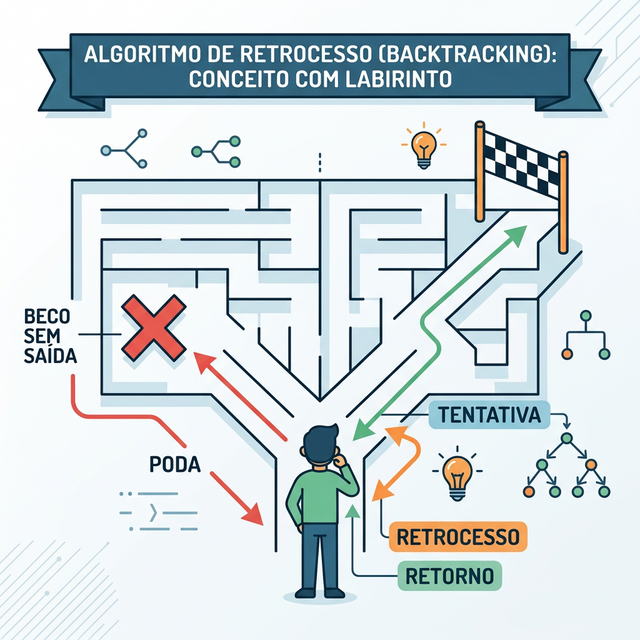

# Módulo 08: Recursão e Backtracking

## Sumário
- [1. Introdução](#1-introdução-ao-módulo)
- [2. Fundamentos de Recursão](#2-fundamentos-de-recursão)
- [3. O que é Backtracking?](#3-o-que-é-backtracking)
- [4. Exercícios de Fixação](#4-exercícios-de-fixação)
- [5. Conclusão](#5-conclusão)

---

## 1. Introdução ao Módulo

Muitas vezes, a melhor forma de resolver um problema grande é resolver uma versão menor dele mesmo. Isso é recursão. Quando combinamos recursão com "tentativa e erro" inteligente, temos o Backtracking.

---

## 2. Fundamentos de Recursão

Recursão ocorre quando uma função chama a si mesma. Para não chamar infinitamente (Stack Overflow), precisamos de um **Caso Base**.

### A Pilha de Chamadas (Call Stack)
Cada vez que uma função é chamada, o computador "empilha" o estado atual. Quando ela retorna, ele "desempilha".


```python
def fatorial(n):
    if n == 0: # Caso Base
        return 1
    return n * fatorial(n - 1) # Chamada Recursiva
```

---

## 3. O que é Backtracking?

Backtracking é uma técnica para explorar sistematicamente todas as soluções potenciais de um problema. É um "Deep-First Search" no espaço de soluções.

**Algoritmo Genérico:**
1.  Faça uma escolha.
2.  Avance recursivamente.
3.  Se a escolha levar a uma solução, ótimo!
4.  Se não, **desfaça** a escolha (backtrack) e tente a próxima opção.

**Poda (Pruning):** Se percebermos cedo que um caminho não vai dar certo, paramos imediatamente (podamos a árvore) sem explorar os filhos.



### Exemplos Clássicos
- Resolver Labirintos.
- N-Rainhas (N-Queens).
- Sudoku.

---

## 4. Exercícios de Fixação

**Exercício 1:** O que acontece se omitirmos o caso base em uma função recursiva?
a) Ela retorna 0.

b) Ela entra em loop infinito até estourar a pilha (Stack Overflow Error).

c) O compilador/interpretador corrige automaticamente.

d) Nada, o computador sabe quando parar.

<details>
<summary>Ver Resposta</summary>

**Resposta:** b) Ela retorna erro de Stack Overflow.

**Explicação:** Sem caso base, a função continua empilhando chamadas até acabar a memória reservada para a pilha.
</details>

**Exercício 2:** Backtracking é sempre mais rápido que força bruta pura?
a) Não, é a mesma coisa.

b) Sim, pois a "poda" (pruning) elimina grandes partes do espaço de busca inútil.

c) Sim, é sempre O(1).

d) Não, é mais lento por causa da recursão.

<details>
<summary>Ver Resposta</summary>

**Resposta:** b) Sim, por conta da poda.

**Explicação:** Embora o pior caso do backtracking ainda possa ser exponencial, na prática ele é muito mais rápido que testar todas as combinações aleatórias, pois descarta milhões de possibilidades inválidas logo no início.
</details>

---

## 5. Conclusão

Recursão simplifica código complexo. Backtracking resolve problemas que parecem impossíveis (como Sudoku) de forma elegante e (relativamente) eficiente.

[Próximo módulo →](../teoria/modulo_09_design_de_sistemas.md)

[Voltar aos Links Rápidos](../README.md#links-rapidos)
