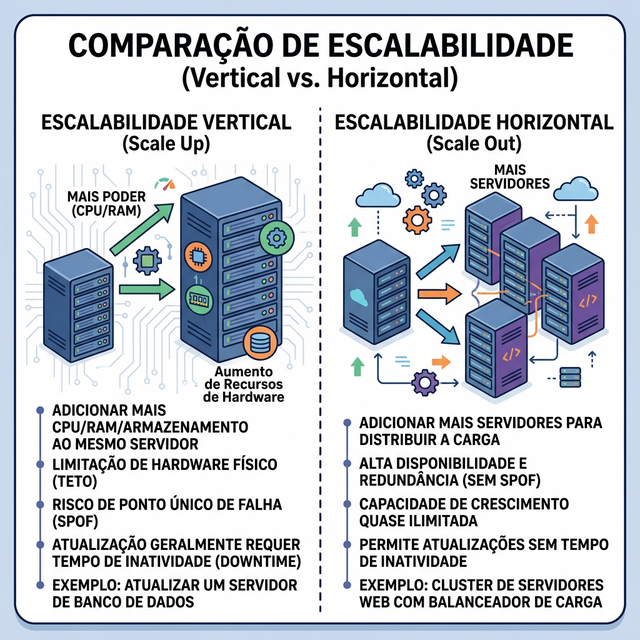
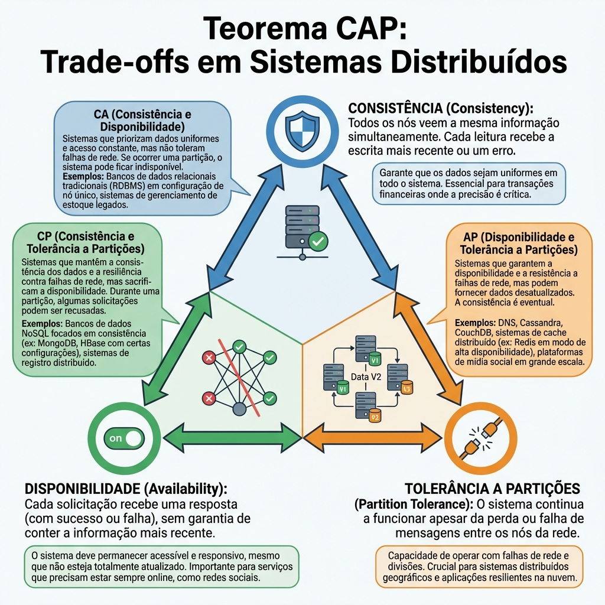
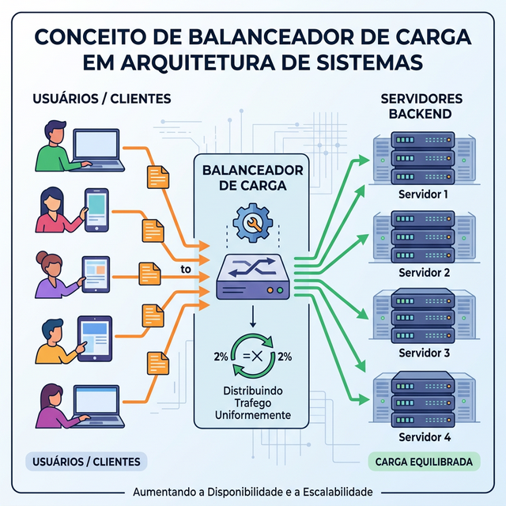

# Módulo 09: Design de Sistemas

## Sumário
- [1. Introdução](#1-introdução-ao-módulo)
- [2. Fundamentos e Pilares](#2-fundamentos-e-pilares)
- [3. Bancos de Dados e Caching](#3-bancos-de-dados-e-caching)
- [4. Arquitetura Avançada](#4-arquitetura-avançada)
- [5. Exercícios de Fixação](#5-exercícios-de-fixação)
- [6. Conclusão](#6-conclusão)

---

## 1. Introdução ao Módulo

Design de Sistemas é a arte de definir a arquitetura, componentes e interfaces de um sistema para atender a requisitos específicos. Em grandes empresas de tecnologia (Big Techs), essa é uma das habilidades mais valorizadas.

---

## 2. Fundamentos e Pilares

### Escalabilidade
Como seu sistema lida com o aumento de usuários?
- **Escalabilidade Vertical (Scale Up):** Adicionar mais RAM/CPU a uma única máquina. Tem limite físico.
- **Escalabilidade Horizontal (Scale Out):** Adicionar mais máquinas ao pool de recursos. Teoricamente ilimitado, mas complexo de gerenciar.

### Disponibilidade vs Consistência
**Teorema CAP:** Em um sistema distribuído, você só pode ter 2 de 3:
1.  **C**onsistência (Todos veem os mesmos dados ao mesmo tempo)
2.  **A**vailability (Disponibilidade - O sistema sempre responde)
3.  **P**artition Tolerance (Resistência a falhas de rede)

---

## 3. Bancos de Dados e Caching

### SQL vs NoSQL
- **SQL (Relacional):** Dados estruturados (tabelas), ACID, Schemas rígidos. Ótimo para pagamentos, dados consistentes.
- **NoSQL (Não-Relacional):** Flexível (documentos, chave-valor), escalável horizontalmente. Ótimo para redes sociais, catálogos, logs.

### Caching
"O dado mais rápido é aquele que você não precisa buscar no banco."
Usa-se memória RAM (Redis, Memcached) para guardar dados acessados frequentemente.

---

## 4. Arquitetura Avançada

### Load Balancers (Balanceadores de Carga)
Distribuem o tráfego de entrada entre vários servidores para evitar sobrecarga.

### Comunicação
- **REST:** Padrão clássico HTTP.
- **GraphQL:** Cliente pede exatamente o que quer.
- **gRPC:** Comunicação rápida entre microsserviços.

---

## 5. Exercícios de Fixação

**Exercício 1:** Você está projetando o Twitter. Você precisa de alta disponibilidade (o site nunca cai) e tolerância a partição. Segundo o Teorema CAP, o que você deve sacrificar?
a) Velocidade

b) Custo

c) Consistência (Eventual Consistency)

d) Segurança

Ver Resposta

**Resposta:** c) Consistência

**Explicação:** É aceitável que um tweet leve alguns segundos para aparecer na timeline de todos (Consistência Eventual) em troca de o site estar sempre no ar para postar (Disponibilidade).

**Exercício 2:** Qual a melhor estratégia para escalar um banco de dados Relacional (SQL) que está sofrendo com muitas leituras?
a) Migrar tudo para NoSQL.

b) Adicionar Réplicas de Leitura (Read Replicas).

c) Aumentar o tamanho do cabo de rede.

d) Deletar dados antigos.

Ver Resposta

**Resposta:** b) Adicionar Réplicas de Leitura

**Explicação:** O padrão Master-Slave permite que uma máquina (Master) receba escritas e várias outras (Slaves) sirvam as leituras, aliviando a carga.

---

## 6. Conclusão

Design de Sistemas não tem "resposta certa", tem **trade-offs** (compromissos). Saber escolher entre consistência e latência é o que define um arquiteto sênior.

[Voltar aos Links Rápidos](../README.md#links-rapidos)
